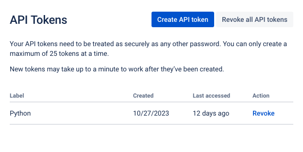
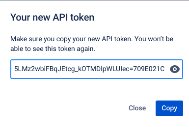

> Note: The [PDF version](https://aeadataeditor.github.io/processing-jira-process-data/README.pdf) of this document is transformed by manually printing from a browser.

## Overview
This README describes how to process data for the AEA Pre-publication Verification Service. The code constructs the analysis file from raw process data extracted from Jira using an API. The replicator should expect the code to run for approximately ZZ hours.

## Data Availability and Provenance Statements
Data used originates from Jira system used by the AEA data editor and the members of his replication lab.

### Statement about Rights
- [x] I certify that the author(s) of the manuscript have legitimate access to and permission to use the data used in this manuscript.
- [x] I certify that the author(s) of the manuscript have documented permission to redistribute/publish the data contained within this replication package.

### Summary of Availability
- [x] Some data **cannot be made** publicly available.
- [x] Confidential data used are not provided as part of the public replication package.

## Details on the Data

### Raw process data


Raw process data from each step of the workflow is extracted from Jira using API (see Instructions to Replicators for details), and saved as `issue_history_MM-DD-YYYY.csv` (for detailed transaction-level data)

The data is not made available outside of the organization, as it contains names of replicators, manuscript numbers, and verbatim email correspondence. An anonymized version without identifying information is made available instead.

To obtain, run `programs/01_download_issues.py`. This will use the fields as specified in `data/metadata/jira-fields.xlsx`. If fields need to be updated (they are keyed on names), run `programs/00_jira_fields.py` to obtain a new Excel file, and mark the to-be-included fields with "True".

A full download of JIRA issues as of 2025 would be

```
> python3 01_download_issues.py -s 2018-01-01 -e 2024-11-30
Summary:
- Start Date: 2018-01-01
- End Date: 2024-11-30

 About to extract all issue history between these dates from https://aeadataeditors.atlassian.net.
 The output will be written to /home/rstudio/data/confidential/issue_history_2024-12-03.csv.
```


At this time, the latest extract was made 2025-01-26. 

#### Anonymized data
We subset the raw data to variables of interest, and substitute random numbers for sensitive strings. This is done by running `02_jira_anonymize.R`. The programs saves both the confidential version and the anonymized version.


```r
source(file.path(programs,"02_jira_anonymize.R"),echo=TRUE)
```

```
## 
## > source(here::here("programs", "config.R"), echo = TRUE)
## 
## > process_raw <- TRUE
## 
## > download_raw <- TRUE
## 
## > extractday <- "2025-02-05"
## 
## > firstday <- "2023-12-01"
## 
## > lastday <- "2024-11-30"
## 
## > basepath <- here::here()
## 
## > setwd(basepath)
## 
## > jiraconf <- file.path(basepath, "data", "confidential")
## 
## > jiraanon <- file.path(basepath, "data", "anon")
## 
## > jirameta <- file.path(basepath, "data", "metadata")
## 
## > images <- file.path(basepath, "images")
## 
## > tables <- file.path(basepath, "tables")
## 
## > programs <- file.path(basepath, "programs")
## 
## > temp <- file.path(basepath, "data", "temp")
## 
## > for (dir in list(images, tables, programs, temp)) {
## +     if (file.exists(dir)) {
## +     }
## +     else {
## +         dir.create(file.path(dir))
## +     }
##  .... [TRUNCATED] 
## 
## > issue_history.prefix <- "issue_history_"
## 
## > manuscript.lookup <- "mc-lookup"
## 
## > manuscript.lookup.rds <- file.path(jiraconf, paste0(manuscript.lookup, 
## +     ".RDS"))
## 
## > assignee.lookup <- "assignee-lookup"
## 
## > assignee.lookup.rds <- file.path(jiraconf, paste0(assignee.lookup, 
## +     ".RDS"))
## 
## > jira.conf.plus.base <- "jira.conf.plus"
## 
## > jira.conf.plus.rds <- file.path(jiraconf, paste0(jira.conf.plus.base, 
## +     ".RDS"))
## 
## > jira.conf.names.csv <- "jira_conf_names.csv"
## 
## > members.txt <- file.path(jiraanon, "replicationlab_members.txt")
## 
## > jira.anon.base <- "jira.anon"
## 
## > jira.anon.rds <- file.path(jiraanon, paste0(jira.anon.base, 
## +     ".RDS"))
## 
## > jira.anon.csv <- file.path(jiraanon, paste0(jira.anon.base, 
## +     ".csv"))
## 
## > if (file.exists(here::here("programs", "confidential-config.R"))) {
## +     source(here::here("programs", "confidential-config.R"))
## +     message("Con ..." ... [TRUNCATED] 
## 
## > source(here::here("global-libraries.R"), echo = TRUE)
## 
## > ppm.date <- "2023-11-01"
## 
## > options(repos = paste0("https://packagemanager.posit.co/cran/", 
## +     ppm.date, "/"))
## 
## > global.libraries <- c("dplyr", "stringr", "tidyr", 
## +     "knitr", "readr", "here", "splitstackshape", "boxr", "jose", 
## +     "rmarkdown", "tidylog" .... [TRUNCATED] 
## 
## > pkgTest <- function(x) {
## +     if (!require(x, character.only = TRUE)) {
## +         install.packages(x, dep = TRUE)
## +         if (!require(x, charact .... [TRUNCATED] 
## 
## > pkgTest.github <- function(x, source) {
## +     if (!require(x, character.only = TRUE)) {
## +         install_github(paste(source, x, sep = "/"))
## +      .... [TRUNCATED] 
## 
## > results <- sapply(as.list(global.libraries), pkgTest)
## 
## > exportfile <- paste0(issue_history.prefix, extractday, 
## +     ".csv")
## 
## > if (!file.exists(file.path(jiraconf, exportfile))) {
## +     process_raw = FALSE
## +     print("Input file for anonymization not found - setting global  ..." ... [TRUNCATED] 
## [1] "Input file for anonymization not found - setting global parameter to FALSE"
## 
## > if (process_raw == TRUE) {
## +     jira.conf.raw <- read.csv(file.path(jiraconf, exportfile), 
## +         stringsAsFactors = FALSE) %>% rename(ticket = .... [TRUNCATED] 
## [1] "Not processing anonymization due to global parameter."
```

### Publishing data

Some additional cleaning and matching, and then we write out the file


```r
source(file.path(programs,"10_jira_anon_publish.R"),echo=TRUE)
```

Finally, we push the confidential data to Box, using the following code, which we specifically run manually:


```bash
cd programs
R CMD BATCH 99_push_box.R
```

## Describing the Data


The anonymized data has 23 columns. 

### Variables


|name                        |label                                                                                                                                                                    |
|:---------------------------|:------------------------------------------------------------------------------------------------------------------------------------------------------------------------|
|ticket                      |The tracking number within the system. Project specific. Sequentially assigned upon receipt.                                                                             |
|mc_number_anon              |The (anonymized) number assigned by the editorial workflow system (Manuscript Central/ ScholarOne) to a manuscript. This is purged by a script of any revision suffixes. |
|assignee_anon               |Anonymized assignee name (time-varying)                                                                                                                                  |
|date_created                |Creation date of issue                                                                                                                                                   |
|received                    |An indicator for whether the issue is just created and has not been assigned to a replicator yet.                                                                        |
|Journal                     |Journal associated with an issue and manuscript. Derived from the manuscript number. Possibly updated by hand                                                            |
|Status                      |Status associated with a ticket at any point in time. The schema for these has changed over time.                                                                        |
|external                    |An indicator for whether the issue required  external validation.                                                                                                        |
|Resolution                  |Resolution associated with a ticket at the end of the reproducibility check.                                                                                             |
|reason.failure              |A list of reasons for failure to fully reproduce.                                                                                                                        |
|MCRecommendation            |Decision status when the issue is Revise and Resubmit.                                                                                                                   |
|MCRecommendationV2          |Decision status when the issue is conditionally accepted.                                                                                                                |
|External.party.name         |Name of the external party. Usually only institutional names.                                                                                                            |
|Non.compliant               |An indicator for whether the issue is non-compliant for some reason.                                                                                                     |
|DCAF_Access_Restrictions    |Category of Access Restrictions (2 categories)                                                                                                                           |
|DCAF_Access_Restrictions_V2 |Category of Access Restrictions (4 categories)                                                                                                                           |
|Update.type                 |Who initiated the need to update the replication package                                                                                                                 |
|Software.used               |Manually coded software used in the replication package                                                                                                                  |
|Agreement.signed            |Type of agreements signed by Data Editor to obtain private data                                                                                                          |
|MCStatus                    |Status of the manuscript in the editorial workflow system.                                                                                                               |
|As.Of.Date                  |Date and time stamp of the issue transaction                                                                                                                             |
|date_asof                   |Date part of the issue transaction                                                                                                                                       |
|date_resolved               |The date the issue was resolved.                                                                                                                                         |

### Lab members during this period

We list the lab members active at some point during this period. This still requires confidential data as an input.


There were a total of 49 lab members over the course of the 12 month period.

### R session info


```r
sessionInfo()
```

```
## R version 4.2.3 (2023-03-15)
## Platform: x86_64-pc-linux-gnu (64-bit)
## Running under: Ubuntu 22.04.4 LTS
## 
## Matrix products: default
## BLAS:   /usr/lib/x86_64-linux-gnu/openblas-pthread/libblas.so.3
## LAPACK: /usr/lib/x86_64-linux-gnu/openblas-pthread/libopenblasp-r0.3.20.so
## 
## locale:
##  [1] LC_CTYPE=en_US.UTF-8       LC_NUMERIC=C              
##  [3] LC_TIME=en_US.UTF-8        LC_COLLATE=en_US.UTF-8    
##  [5] LC_MONETARY=en_US.UTF-8    LC_MESSAGES=en_US.UTF-8   
##  [7] LC_PAPER=en_US.UTF-8       LC_NAME=C                 
##  [9] LC_ADDRESS=C               LC_TELEPHONE=C            
## [11] LC_MEASUREMENT=en_US.UTF-8 LC_IDENTIFICATION=C       
## 
## attached base packages:
## [1] stats     graphics  grDevices utils     datasets  methods   base     
## 
## other attached packages:
##  [1] tidylog_1.0.2         rmarkdown_2.21        jose_1.2.0           
##  [4] openssl_2.0.6         boxr_0.3.6            splitstackshape_1.4.8
##  [7] here_1.0.1            readr_2.1.4           knitr_1.42           
## [10] tidyr_1.3.0           stringr_1.5.0         dplyr_1.1.1          
## 
## loaded via a namespace (and not attached):
##  [1] bslib_0.4.2       jquerylib_0.1.4   pillar_1.9.0      compiler_4.2.3   
##  [5] tools_4.2.3       bit_4.0.5         digest_0.6.31     jsonlite_1.8.4   
##  [9] evaluate_0.20     lifecycle_1.0.3   tibble_3.2.1      pkgconfig_2.0.3  
## [13] rlang_1.1.0       cli_3.6.1         rstudioapi_0.14   parallel_4.2.3   
## [17] yaml_2.3.7        xfun_0.38         fastmap_1.1.1     withr_2.5.0      
## [21] sass_0.4.5        generics_0.1.3    vctrs_0.6.2       askpass_1.1      
## [25] hms_1.1.3         bit64_4.0.5       rprojroot_2.0.3   tidyselect_1.2.0 
## [29] glue_1.6.2        data.table_1.14.8 R6_2.5.1          fansi_1.0.4      
## [33] vroom_1.6.1       tzdb_0.3.0        purrr_1.0.1       magrittr_2.0.3   
## [37] clisymbols_1.2.0  htmltools_0.5.5   utf8_1.2.3        stringi_1.7.12   
## [41] cachem_1.0.7      crayon_1.5.2
```

## Software Requirements
- R (last run with R 4.2.3)
  - package `here` (>=0.1)
- Python
  - module `venv`
  
Other packages will be installed automatically by the programs, as long as the requirements above are met, see [Session Info](#r-session-info).
R (last run with R r paste0(R.Version()$major, ".", R.Version()$minor))

### R packages

|Package         |Version |
|:---------------|:-------|
|dplyr           |1.1.1   |
|stringr         |1.5.0   |
|tidyr           |1.3.0   |
|knitr           |1.42    |
|readr           |2.1.4   |
|here            |1.0.1   |
|splitstackshape |1.4.8   |
|boxr            |0.3.6   |
|jose            |1.2.0   |
|rmarkdown       |2.21    |
|tidylog         |1.0.2   |

### Python packages

|Modules       |
|:-------------|
|jira          |
|requests      |
|python-dotenv |
|pandas        |
|argparse      |

### Docker
These requirements are satisfied in the Docker image created by `Dockerfile`, see [description below](#setup---1.-docker)

## Controlled Randomness
- [x] No Pseudo random generator is used in the analysis described here.

## Memory, Runtime, Storage Requirements
The code was last run successfully on GitHub Codespaces on a 2-core machine with 8GB RAM and 32GB storage. Approximate time needed to reproduce the analysis varies depending on how much data is downloaded from the Jira API. Downloading the variables listed above took approximately 5 seconds for each case.

## Description of Programs/Code
- 00_get_fields.py: Marks the to-be-extracted JIRA fields with "True" and outputs file `data/metadata/jira-fields.xlsx`
- 01_download_issues.py: Extracts raw process data from Jira using API
- 02_jira_anonymize.R: Subsets the raw data to variables of interest, and substitute random numbers for sensitive strings
- 03_lab_members.R: Outputs list of lab members active at some point during extracted period
- 10_jira_anon_publish.R: Does final cleaning and matching and writes out the anonymized file
- 99_push_box.R: Uploads extracted data to secure Box folder
- 99_render_README.R: Renders Rmd README file

## Instructions to Replicators
- Clone this repository onto your device or a GitHub Codespace

### Set up Docker
- The `Dockerfile` is used to build the Docker image.
- The image is built with the `build.sh` script, which requires a `TAG` argument, and will otherwise read parameters from the [`.myconfig.sh`](.myconfig.sh) file.

```bash
bash ./build.sh TAG
```
> [NOTE]: If working on BioHPC, remember to replace docker with docker1 in the relevant code.

- Use `ls-tags.sh` to list available tags.

```bash
bash ./ls-tags.sh
```

- To run the image as a Rstudio interactive development image, use

```bash
bash ./start_rstudio.sh TAG
```


- It defaults to the 2025-02-05 image if you don't specify a tag.

### Set up JIRA
- Obtain the per-individual API Key
- The API Key is not stored in this repository.
- Go to [https://id.atlassian.com/manage-profile/security/api-tokens](https://id.atlassian.com/manage-profile/security/api-tokens)



- Click on "Create API token"
- Enter a label for the token (e.g. "JIRA Extract")
- Copy the token to the clipboard



- Use it with the Python scripts in this repository, in one of the following ways:
    - Set the environment variable `JIRA_API_KEY` to the token value
      - On github codespaces this involves creating a Github secret with the exact name `JIRA_API_KEY` and value of the key you get from JIRA
    - Create a file named `.env` in the root directory of this project, and add the following line to it:
      `JIRA_API_KEY=<token value>`
    - Pass the token value to the Python scripts when prompted

### Set up Box
- Location: [https://cornell.app.box.com/folder/143352802492](https://cornell.app.box.com/folder/143352802492)🔒
- We use the subfolder [`jira_exports`](https://cornell.app.box.com/folder/235801403908)🔒
- In order to up- and download, you need not just an API key, but a JSON file with other credentials. This file is called `client_enterprise_id,"_",client_key_id,"_config.json"`, e.g. `81483_bkgnsg4p_config.json`
  - The `client_enterprise_id` is identified in the JSON file itself as well
  - The `client_key_id` is the name of the key in the [Box developer console](https://cornell.app.box.com/developers/console/app/1590771/configuration)🔒
- The JSON file is key
  - It is not stored in this repository, but is stored in the Box folder `InternalData`
  - To use this, the file must be downloaded and stored in the root of the project directory
- Then the `.env` file needs to be appropriately adjusted with the relevant numbers as per below entered:

```dotenv
BOX_FOLDER_ID=12345678890
BOX_PRIVATE_KEY_ID=abcdef4g
BOX_ENTERPRISE_ID=123456
```

- Here:
  - The BOX_FOLDER_ID is the 12 digit number in the URL of the box folder `.../folder/12345678890?...` 
  - The BOX_PRIVATE_KEY_ID refers to the `publicKeyID` in the JSON file
  - The BOX_ENTERPRISE_ID is the number at the beginning of the name of the JSON file
- Alternatively, on Github Codespaces, these need to be encoded as secrets.

### Start Docker and Set up Environment

- Run `./start_rstudio.sh` (bash ./start_rstudio.sh from the command line) it should pull the image from the docker and open a port for you to develop in a familiar RStudio environment
  - On GitHub Codespaces you can access this port by clicking on ports and then the little globe icon to open it in a new tab
  - On a local computer, you may need to open a browser at <http://localhost:8787>
  - To obtain a console in the running Docker container, open a second terminal and connect: `
  
```bash
container_id=$(docker container ls | head -2 | tail -1 | awk ' { print $1 } ')
docker exec -it -u rstudio $container_id /bin/bash`
```

> [NOTE]: The remainder of the instructions assume you are working within the Docker environment. Adjust as necessary if you are only using the code base in your own environment.

- Change to the correct working directory:
  - Rstudio: click on `processing-jira-process-data/processing-jira-process-data.Rproj`
  - Console: cd to the correct directory
- Install any missing Python packages by running `pip install -r requirements.txt`.
- Set up **environment variables**:
  - Ensure an `.env` file is present in the root project directory (or your GitHub Secrets are set)
  - Ensure that the Box `JSON` file as outlined above is present in the root project directory
  - Provide JIRA and BOX information
  
> Template file

```
JIRA_USERNAME=
JIRA_API_KEY=
BOX_FOLDER_ID=
BOX_PRIVATE_KEY_ID=
BOX_ENTERPRISE_ID=
```

- Define start and end dates:
  - Update the `extractday`, `firstday`, and `lastday` fields in the [`programs/config.R`](programs/config.R) file.
  - You will need to manually provide them to the Python programs (for now)

### Obtain Extract

- `cd programs`
- To obtain extract **run `python3 01_download_issues.py -s ` 2023-12-01 ` -e ` 2024-11-30** with the relevant dates.
  - This will get the fields as specified in `data/metadata/jira-fields.xlsx`.
  - If fields need to be updated (they are keyed on names), edit `programs/00_jira_fields.py` to obtain the full list of fields, open the resulting Excel file (`data/metadata/jira-fields.xlsx`) and  mark the to-be-included fields with "True"
  - Otherwise running `programs/00_jira_fields.py` is not required.

- **Run R programs in numerical order** to create the confidential and anonymized files used for the report.
  - Running with `R CMD BATCH name_of_file.R` will create the necessary log files.
  - This is encapsulated in the `main.sh` file, for convenience:

```bash
cd programs
bash -x ./main.sh
```

- Push the extracted confidential data to Box, using the following code, which we specifically run manually:


```bash
cd programs
R CMD BATCH 99_push_box.R
```

- Finally, run `99_render_README.Rout` to update the .Rmd README file and output a .md file and .html file.
  - Manually print the .html file to obtain a PDF.

## Citation
> Vilhuber, Lars. 2025. "Process data for the AEA Pre-publication Verification Service." *American Economic Association [publisher]*. Ann Arbor, MI: Inter-university Consortium for Political and Social Research [distributor], 2025-02-19. [https://doi.org/10.3886/E117876V6](https://doi.org/10.3886/E117876V6)

```
@techreport{10.3886/e117876V6,
  doi = {10.3886/E117876V6},
  url = {https://doi.org/10.3886/E117876V6},
  author = {Vilhuber,  Lars},
  title = {Process data for the AEA Pre-publication Verification Service},
  institution = {American Economic Association [publisher]},
  series = {ICPSR - Interuniversity Consortium for Political and Social Research},
  year = {2025}}
```

## References
Vilhuber, Lars. r YEAR. "Process Data for the AEA Pre-publication Verification Service." American Economic Association [publisher]. Ann Arbor, MI: Inter-university Consortium for Political and Social Research [distributor], r Sys.Date(). [r ICPSR_DOI](r ICPSR_DOI).

## Acknowledgements
This README was adapted from the social-science-data-editors/template_README template.

---
