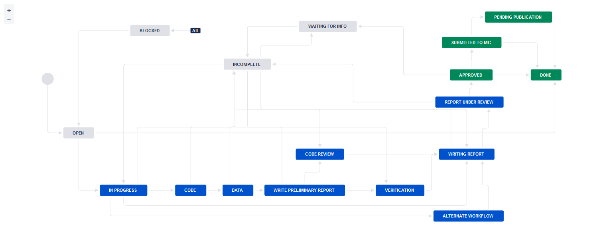

> Note: The [PDF version](https://aeadataeditor.github.io/processing-jira-process-data/README.pdf) of this document is transformed by manually printing from a browser.

## Citation

> Vilhuber, Lars. 2023. "Process data for the AEA Pre-publication Verification Service." *American Economic Association [publisher]*. Ann Arbor, MI: Inter-university Consortium for Political and Social Research [distributor], 2023-05-16. [https://doi.org/10.3886/E117876V3](https://doi.org/10.3886/E117876V4)

```
@techreport{10.3886/e117876v4,
  doi = {10.3886/E117876V4},
  url = {https://www.openicpsr.org/openicpsr/project/117876/version/V4/view},
  author = {Vilhuber,  Lars},
  title = {Process data for the AEA Pre-publication Verification Service},
  institution = {American Economic Association [publisher]},
  series = {ICPSR - Interuniversity Consortium for Political and Social Research},
  year = {2023}
}
```

## Requirements

This project requires

- R (last run with R 4.2.0)
  - package `here` (>=0.1)
  
Other packages might be installed automatically by the programs, as long as the requirements above are met, see [Session Info](#r-session-info).

## Data 

### The workflow



### Raw process data

Raw process data is manually extracted from Jira, and saved as 

- `export_MM-DD-YYYY.csv` (for detailed transaction-level data)

The data is not made available outside of the organization, as it contains names of replicators,  manuscript numbers, and verbatim email correspondence. 


At this time, the latest extract was made 2022-12-12. 

### Anonymized data

We subset the raw data to variables of interest, and substitute random numbers for sensitive strings. This is done by running `01_jira_anonymize.R`. The programs saves both the confidential version and the anonymized version. 


```r
source(file.path(programs,"01_jira_anonymize.R"),echo=TRUE)
```

```
> # Anonymize JIRA process files and construct variables
> # Harry Son, Lars Vilhuber
> # 2021-05-20
> 
> ## Inputs: export_(extractday).csv
> ## Outp .... [TRUNCATED] 

> gc()
          used (Mb) gc trigger (Mb) max used (Mb)
Ncells  640603 34.3    1248601 66.7  1248601 66.7
Vcells 1638994 12.6    8388608 64.0  2011357 15.4

> ### Load libraries 
> ### Requirements: have library *here*
> source(here::here("programs","config.R"),echo=TRUE)

> # ###########################
> # CONFIG: parameters affecting processing
> # ###########################
> 
> ## These control whether the external .... [TRUNCATED] 

> download_raw <- TRUE

> ## This pins the date of the to-be-processed file
> 
> extractday <- "12-12-2022"

> ## These define the start (and end) dates for processing of data
> firstday <- "2021-12-01"

> lastday  <- "2022-11-30"

> # ###########################
> # CONFIG: define paths and filenames for later reference
> # ###########################
> 
> # Change the basepath  .... [TRUNCATED] 

> setwd(basepath)

> # for Jira stuff
> jiraconf <- file.path(basepath,"data","confidential")

> # for local processing
> if ( Sys.getenv("HOSTNAME") == "zotique3" ) {
+   jiraconf <- paste0(Sys.getenv("XDG_RUNTIME_DIR"),"/gvfs/dav:host=dav.box. ..." ... [TRUNCATED] 

> jiraanon <- file.path(basepath,"data","anon")

> jirameta <- file.path(basepath,"data","metadata")

> # local
> images <- file.path(basepath, "images" )

> tables <- file.path(basepath, "tables" )

> programs <- file.path(basepath,"programs")

> temp   <- file.path(basepath,"data","temp")

> for ( dir in list(images,tables,programs,temp)){
+   if (file.exists(dir)){
+   } else {
+     dir.create(file.path(dir))
+   }
+ }

> ####################################
> # global libraries used everywhere #
> ####################################
> 
> mran.date <- "2022-04-22"

> options(repos=paste0("https://cran.microsoft.com/snapshot/",mran.date,"/"))

> pkgTest <- function(x)
+ {
+   if (!require(x,character.only = TRUE))
+   {
+     install.packages(x,dep=TRUE)
+     if(!require(x,character.only =  .... [TRUNCATED] 

> pkgTest.github <- function(x,source)
+ {
+   if (!require(x,character.only = TRUE))
+   {
+     install_github(paste(source,x,sep="/"))
+     if(!re .... [TRUNCATED] 

> if ( file.exists(here::here("programs","confidential-config.R"))) {
+   source(here::here("programs","confidential-config.R"))
+   # if not sourced, .... [TRUNCATED] 

> global.libraries <- c("dplyr","tidyr","splitstackshape")

> results <- sapply(as.list(global.libraries), pkgTest)
Loading required package: dplyr

Attaching package: ‘dplyr’

The following objects are masked from ‘package:stats’:

    filter, lag

The following objects are masked from ‘package:base’:

    intersect, setdiff, setequal, union

Loading required package: tidyr
Loading required package: splitstackshape

> # double-check
> exportfile <- paste0("export_",extractday,".csv")

> if (! file.exists(file.path(jiraconf,exportfile))) {
+   process_raw = FALSE
+   print("Input file for anonymization not found - setting global para ..." ... [TRUNCATED] 

> if ( process_raw == TRUE ) {
+   # Read in data extracted from Jira
+   #base <- here::here()
+   
+   jira.conf.raw <- read.csv(file.path(jiraconf, .... [TRUNCATED] 
Warning messages:
1: package ‘dplyr’ was built under R version 4.2.1 
2: package ‘tidyr’ was built under R version 4.2.1 
```


## Describing the Data


The anonymized data has 15 columns. 

### Variables


```
## 
## ── Column specification ────────────────────────────────────────────────────────
## cols(
##   name = col_character(),
##   label = col_character()
## )
```


|name               |label                                                                                                                                                                    |
|:------------------|:------------------------------------------------------------------------------------------------------------------------------------------------------------------------|
|ticket             |The tracking number within the system. Project specific. Sequentially assigned upon receipt.                                                                             |
|date_created       |Date of a receipt                                                                                                                                                        |
|date_updated       |Date of a transaction                                                                                                                                                    |
|mc_number_anon     |The (anonymized) number assigned by the editorial workflow system (Manuscript Central/ ScholarOne) to a manuscript. This is purged by a script of any revision suffixes. |
|Journal            |Journal associated with an issue and manuscript. Derived from the manuscript number. Possibly updated by hand                                                            |
|Status             |Status associated with a ticket at any point in time. The schema for these has changed over time.                                                                        |
|Software.used      |A list of software used to replicate the issue.                                                                                                                          |
|received           |An indicator for whether the issue is just created and has not been assigned to a replicator yet.                                                                        |
|Changed.Fields     |A transaction will change various fields. These are listed here.                                                                                                         |
|external           |An indicator for whether the issue required the external validation.                                                                                                     |
|subtask            |An indicator for whether the issue is a subtask of another task.                                                                                                         |
|Resolution         |Resolution associated with a ticket at the end of the replication process.                                                                                               |
|reason.failure     |A list of reasons for failure to fully replicate.                                                                                                                        |
|MCRecommendation   |Decision status when the issue is Revise and Resubmit.                                                                                                                   |
|MCRecommendationV2 |Decision status when the issue is conditionally accepted.                                                                                                                |

### Sample records


|ticket      |date_created |date_updated | mc_number_anon|Journal               |Status      |Software.used |received |Changed.Fields                |external |subtask |Resolution |reason.failure |MCRecommendation |MCRecommendationV2 |
|:-----------|:------------|:------------|--------------:|:---------------------|:-----------|:-------------|:--------|:-----------------------------|:--------|:-------|:----------|:--------------|:----------------|:------------------|
|AEAREP-2812 |2021-12-08   |2021-12-08   |            979|AEJ:Applied Economics |In Progress |Stata,R       |No       |Software used,Status          |No       |NA      |           |               |                 |                   |
|AEAREP-2812 |2021-12-08   |2021-12-08   |            979|AEJ:Applied Economics |Assigned    |              |No       |Assignee,Status               |No       |NA      |           |               |                 |                   |
|AEAREP-2812 |2021-12-08   |2021-12-08   |            979|AEJ:Applied Economics |Open        |              |No       |openICPSR Project Number      |No       |NA      |           |               |                 |                   |
|AEAREP-2812 |2021-12-08   |2021-12-08   |            979|AEJ:Applied Economics |Open        |              |No       |DCAF_Access_Restrictions      |No       |NA      |           |               |                 |                   |
|AEAREP-2812 |2021-12-08   |2021-12-08   |            979|AEJ:Applied Economics |Open        |              |NA       |Journal                       |No       |NA      |           |               |                 |                   |
|AEAREP-2812 |2021-12-08   |2021-12-08   |            979|                      |Open        |              |NA       |Manuscript Central identifier |No       |NA      |           |               |                 |                   |

### Lab members and external replicators during this period

We list the lab members and external replicators active at some point during this period.


```r
source(file.path(programs,"03_lab_members.R"),echo=TRUE)
```

```
> # Export lab members worked during the designated period.
> # Harry Son
> # 2021-03-14
> 
> ## Inputs: export_12-22-2020.csv
> ## Outputs: file.path .... [TRUNCATED] 

> gc()
          used (Mb) gc trigger  (Mb) max used  (Mb)
Ncells 1057473 56.5    2044040 109.2  1626032  86.9
Vcells 3022854 23.1   26132076 199.4 32665094 249.3

> ### Load libraries 
> ### Requirements: have library *here*
> source(here::here("programs","config.R"),echo=TRUE)

> # ###########################
> # CONFIG: parameters affecting processing
> # ###########################
> 
> ## These control whether the external .... [TRUNCATED] 

> download_raw <- TRUE

> ## This pins the date of the to-be-processed file
> 
> extractday <- "12-12-2022"

> ## These define the start (and end) dates for processing of data
> firstday <- "2021-12-01"

> lastday  <- "2022-11-30"

> # ###########################
> # CONFIG: define paths and filenames for later reference
> # ###########################
> 
> # Change the basepath  .... [TRUNCATED] 

> setwd(basepath)

> # for Jira stuff
> jiraconf <- file.path(basepath,"data","confidential")

> # for local processing
> if ( Sys.getenv("HOSTNAME") == "zotique3" ) {
+   jiraconf <- paste0(Sys.getenv("XDG_RUNTIME_DIR"),"/gvfs/dav:host=dav.box. ..." ... [TRUNCATED] 

> jiraanon <- file.path(basepath,"data","anon")

> jirameta <- file.path(basepath,"data","metadata")

> # local
> images <- file.path(basepath, "images" )

> tables <- file.path(basepath, "tables" )

> programs <- file.path(basepath,"programs")

> temp   <- file.path(basepath,"data","temp")

> for ( dir in list(images,tables,programs,temp)){
+   if (file.exists(dir)){
+   } else {
+     dir.create(file.path(dir))
+   }
+ }

> ####################################
> # global libraries used everywhere #
> ####################################
> 
> mran.date <- "2022-04-22"

> options(repos=paste0("https://cran.microsoft.com/snapshot/",mran.date,"/"))

> pkgTest <- function(x)
+ {
+   if (!require(x,character.only = TRUE))
+   {
+     install.packages(x,dep=TRUE)
+     if(!require(x,character.only =  .... [TRUNCATED] 

> pkgTest.github <- function(x,source)
+ {
+   if (!require(x,character.only = TRUE))
+   {
+     install_github(paste(source,x,sep="/"))
+     if(!re .... [TRUNCATED] 

> global.libraries <- c("dplyr","tidyr","splitstackshape")

> results <- sapply(as.list(global.libraries), pkgTest)

> jira.conf.plus <- readRDS(file=file.path(jiraconf,"jira.conf.plus.RDS"))

> lab.member <- jira.conf.plus %>%
+   filter(Change.Author!=""&Change.Author!="Automation for Jira"&Change.Author!="LV (Data Editor)") %>%
+   mutate .... [TRUNCATED] 

> write.table(lab.member, file = file.path(basepath,"data","replicationlab_members.txt"), sep = "\t",
+             row.names = FALSE)

> ### Repeat process for external replicators
> external.member <- jira.conf.plus %>%
+   filter(External.party.name!="") %>%
+   mutate(date_created  .... [TRUNCATED] 

> write.table(external.member, file = file.path(basepath,"data","external_replicators.txt"), sep = "\t",
+             row.names = FALSE)
Warning messages:
1: In type.convert.default(X[[i]], ...) :
  'as.is' should be specified by the caller; using TRUE
2: In type.convert.default(X[[i]], ...) :
  'as.is' should be specified by the caller; using TRUE
3: In type.convert.default(X[[i]], ...) :
  'as.is' should be specified by the caller; using TRUE
4: In type.convert.default(unlist(x, use.names = FALSE)) :
  'as.is' should be specified by the caller; using TRUE
```

There were a total of 42 lab members and 6 external replicators over the course of the 12 month period.

### R session info


```r
sessionInfo()
```

```
R version 4.2.0 (2022-04-22 ucrt)
Platform: x86_64-w64-mingw32/x64 (64-bit)
Running under: Windows Server x64 (build 20348)

Matrix products: default

locale:
[1] LC_COLLATE=English_United States.utf8  LC_CTYPE=English_United States.utf8    LC_MONETARY=English_United States.utf8
[4] LC_NUMERIC=C                           LC_TIME=English_United States.utf8    

attached base packages:
[1] stats     graphics  grDevices utils     datasets  methods   base     

other attached packages:
[1] splitstackshape_1.4.8 tidyr_1.2.0           dplyr_1.0.9          

loaded via a namespace (and not attached):
 [1] here_1.0.1        fansi_1.0.4       assertthat_0.2.1  utf8_1.2.3        rprojroot_2.0.2   R6_2.5.1         
 [7] DBI_1.1.1         lifecycle_1.0.3   magrittr_2.0.3    pillar_1.8.1      rlang_1.0.6       cli_3.3.0        
[13] data.table_1.14.2 rstudioapi_0.13   ellipsis_0.3.2    vctrs_0.5.2       generics_0.1.0    tools_4.2.0      
[19] glue_1.6.2        purrr_0.3.4       compiler_4.2.0    pkgconfig_2.0.3   tidyselect_1.1.2  tibble_3.1.8 
```


