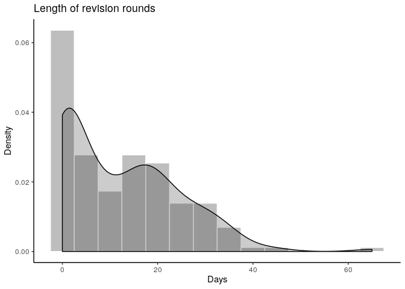
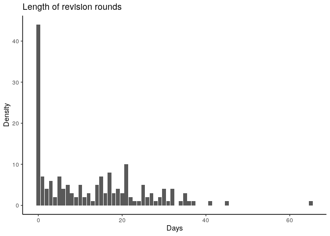
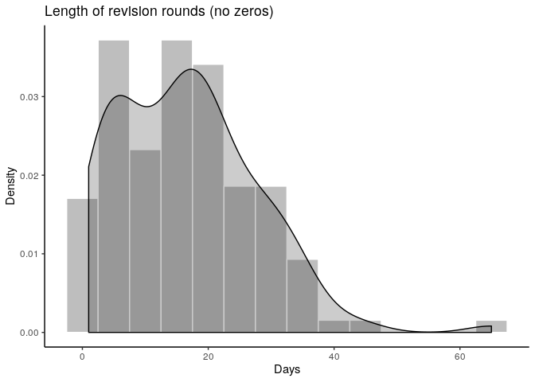
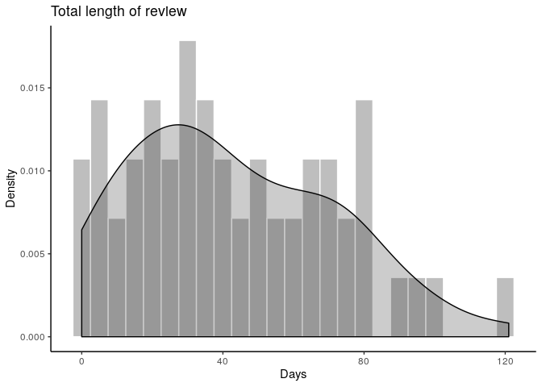
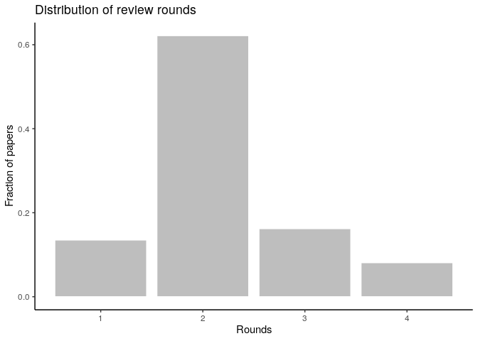
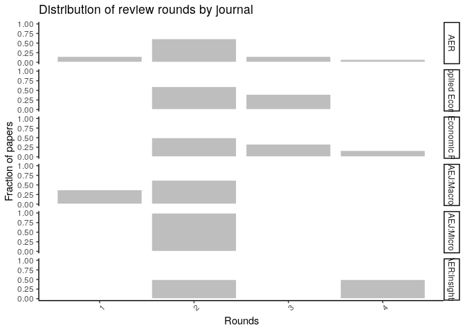
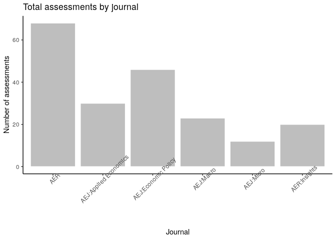
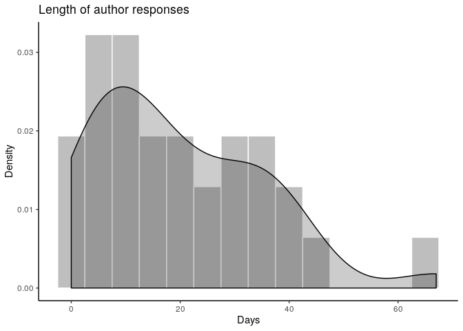

> Note: The PDF version of this document is transformed by manually printing from a browser.

## Requirements
This project requires
- R (last run with R 3.6.2)
  - package `here` (>=0.1)
  
Other packages might be installed automatically by the programs, as long as the requirements above are met.

## Data 

### The workflow


### Raw process data
Raw process data is manually extracted from Jira, and saved as 
- `jira-simple-export_MM-DD-YYYY.csv` (for collapsed information on issues)
- `export_MM-DD-YYYY.csv` (for detailed transaction-level data)

We currently only use the latter. The data is not made available outside of the organization, as it contains names of replicators,  manuscript numbers, and verbatim email correspondence. 


At this time, the latest extract was made 11-28-2019. 

### Anonymized data
We subset the raw data to variables of interest, and substitute random numbers for sensitive strings. This is done by running `04_jira_anonymize.R`:


```r
source(file.path(programs,"04_jira_anonymize.R"),echo=TRUE)
```


## Describing the Data


The anonymized data has 7 columns. 

### Variables


name                 description                                                                                                                                                                                                                                 
-------------------  --------------------------------------------------------------------------------------------------------------------------------------------------------------------------------------------------------------------------------------------
ticket               The tracking number within the system. May be project specific, is sequentially assigned upon receipt.                                                                                                                                      
date                 Date of a transaction                                                                                                                                                                                                                       
Journal              Journal associated with an issue and manuscript. Derived from the manuscript number, possibly updated by hand                                                                                                                               
Status               Status associated with a ticket at any point in time. The schema for these has changed over time.                                                                                                                                           
Changed.Fields       A transaction will change various fields. These are listed here.                                                                                                                                                                            
Change.Author.Anon   The author ID associated with a change of field values                                                                                                                                                                                      
mc_number_anon       The (anonymized) number assigned by the editorial workflow system (Manuscript Central/ ScholarOne) to a manuscript. This is purged by a script of any revision suffixes, and is used to connect tickets over time when there are revisions. 

### Sample records


ticket       date         Journal        Status   Changed.Fields    Change.Author.Anon    mc_number_anon
-----------  -----------  -------------  -------  ----------------  -------------------  ---------------
AEAREP-346   2019-11-28   AER:Insights   Open                       Author 14                         49
AEAREP-346   2019-11-26   AER:Insights   Open     JiraSearchMC      Author 7                          49
AEAREP-346   2019-11-26   AER:Insights   Open     MCStatus          Author 7                          49
AEAREP-346   2019-11-26   AER:Insights   Open     MCEntryURL        Author 7                          49
AEAREP-346   2019-11-26   AER:Insights   Open     Code provenance   Author 7                          49
AEAREP-346   2019-11-26   AER:Insights   Open     Journal           Author 7                          49


## Some Analysis


```
## [1] "2020-02-24"
```

```
## 
## > source(here::here("programs", "config.R"), echo = TRUE)
## 
## > process_raw <- FALSE
## 
## > basepath <- here::here()
## 
## > setwd(basepath)
## 
## > jirabase <- file.path(basepath, "data", "confidential")
## 
## > jiraanon <- file.path(basepath, "data", "anon")
## 
## > jirameta <- file.path(basepath, "data", "metadata")
## 
## > images <- file.path(basepath, "images")
## 
## > tables <- file.path(basepath, "tables")
## 
## > programs <- file.path(basepath, "programs")
## 
## > for (dir in list(images, tables, programs)) {
## +     if (file.exists(dir)) {
## +     }
## +     else {
## +         dir.create(file.path(dir))
## +     }
## + }
## 
## > set.seed(20200201)
## 
## > pkgTest <- function(x) {
## +     if (!require(x, character.only = TRUE)) {
## +         install.packages(x, dep = TRUE)
## +         if (!require(x, charact .... [TRUNCATED] 
## 
## > pkgTest.github <- function(x, source) {
## +     if (!require(x, character.only = TRUE)) {
## +         install_github(paste(source, x, sep = "/"))
## +      .... [TRUNCATED] 
## 
## > global.libraries <- c("ggplot2", "dplyr", "reshape2", 
## +     "here")
## 
## > results <- sapply(as.list(global.libraries), pkgTest)
```

```
## Loading required package: ggplot2
```

```
## Loading required package: reshape2
```

```
## 
## Attaching package: 'reshape2'
```

```
## The following object is masked from 'package:tidyr':
## 
##     smiths
```

```
## Loading required package: here
```

```
## here() starts at /mnt/local/slow_home/vilhuber/Workspace-non-encrypted/git/AEA/processing-jira-process-data
```

```
## 
## > pkgTest.github("data.table", "Rdatatable")
```

```
## Loading required package: data.table
```

```
## 
## Attaching package: 'data.table'
```

```
## The following objects are masked from 'package:reshape2':
## 
##     dcast, melt
```

```
## The following objects are masked from 'package:dplyr':
## 
##     between, first, last
```

```
## [1] "OK"
## 
## > jira <- readRDS(file.path(jiraanon, "jira.anon.RDS"))
## 
## > jira.manuscripts <- jira %>% select(mc_number_anon) %>% 
## +     distinct()
## 
## > unique_total <- nrow(jira.manuscripts)
## 
## > unique_total_journal <- jira %>% group_by(Journal) %>% 
## +     summarise(unique_mc_numbers = n_distinct(mc_number_anon))
## 
## > duration.data <- jira %>% mutate(Status = ifelse(Status == 
## +     "Submitted to MC" & Changed.Fields == "Status" & Change.Author.Anon == 
## +     "Lar ..." ... [TRUNCATED] 
## 
## > table.duration <- duration.data %>% group_by(length) %>% 
## +     summarise(n_tickets = n_distinct(ticket))
## 
## > revision_round_length <- ggplot(duration.data, aes(x = length)) + 
## +     geom_histogram(aes(y = ..density..), colour = "white", fill = "grey", 
## +    .... [TRUNCATED] 
## 
## > revision_round_length.bar <- ggplot(table.duration, 
## +     aes(x = length, y = n_tickets)) + geom_bar(stat = "identity") + 
## +     theme_classic() +  .... [TRUNCATED] 
## 
## > revision_round_length.pos <- ggplot(duration.data %>% 
## +     filter(length >= 1), aes(x = length)) + geom_histogram(aes(y = ..density..), 
## +     col .... [TRUNCATED] 
## 
## > ggsave(file.path(images, "revision_round_length_hist.png"), 
## +     revision_round_length + labs(y = element_blank(), title = element_blank()))
```

```
## Saving 7 x 5 in image
```

```
## Don't know how to automatically pick scale for object of type difftime. Defaulting to continuous.
```

```
## 
## > ggsave(file.path(images, "revision_round_length_hist2.png"), 
## +     revision_round_length.bar + labs(y = element_blank(), title = element_blank()))
```

```
## Saving 7 x 5 in image
## Don't know how to automatically pick scale for object of type difftime. Defaulting to continuous.
```

```
## 
## > ggsave(file.path(images, "revision_round_length_hist_pos.png"), 
## +     revision_round_length.pos + labs(y = element_blank(), title = element_blank() .... [TRUNCATED]
```

```
## Saving 7 x 5 in image
## Don't know how to automatically pick scale for object of type difftime. Defaulting to continuous.
```

```
## 
## > revision_round_length
```

```
## Don't know how to automatically pick scale for object of type difftime. Defaulting to continuous.
```

<!-- -->

```
## 
## > revision_round_length.bar
```

```
## Don't know how to automatically pick scale for object of type difftime. Defaulting to continuous.
```

<!-- -->

```
## 
## > revision_round_length.pos
```

```
## Don't know how to automatically pick scale for object of type difftime. Defaulting to continuous.
```

```
## 
## > mean(duration.data$length)
## Time difference of 12.33526 days
## 
## > median(duration.data$length)
## Time difference of 10 days
## 
## > tmp <- mutate(duration.data, n_length = as.numeric(length)) %>% 
## +     select(n_length) %>% filter(n_length >= 1)
## 
## > mean(tmp$n_length)
## [1] 16.54264
## 
## > median(tmp$n_length)
## [1] 16
## 
## > length.data <- jira %>% mutate(Status = ifelse(Status == 
## +     "Submitted to MC" & Changed.Fields == "Status" & Change.Author.Anon == 
## +     "Lars  ..." ... [TRUNCATED] 
## 
## > table.issue.length <- length.data %>% group_by(length) %>% 
## +     summarise(n_tickets = n_distinct(mc_number_anon))
## 
## > fig.total_length <- ggplot(table.issue.length, aes(x = length)) + 
## +     geom_histogram(aes(y = ..density..), colour = "white", fill = "grey", 
## +    .... [TRUNCATED] 
## 
## > ggsave(file.path(images, "total_length_hist.png"), 
## +     fig.total_length + labs(y = element_blank(), title = element_blank()))
```

```
## Saving 7 x 5 in image
## Don't know how to automatically pick scale for object of type difftime. Defaulting to continuous.
```

<!-- -->

```
## 
## > fig.total_length
```

```
## Don't know how to automatically pick scale for object of type difftime. Defaulting to continuous.
```

```
## 
## > author_length <- jira %>% filter(mc_number_anon != 
## +     "", ticket != mc_number_anon, !grepl("#", mc_number_anon, 
## +     fixed = TRUE)) %>% select .... [TRUNCATED] 
## 
## > n_rounds <- author_length %>% mutate(completed = ifelse(grepl("Pending publication", 
## +     Status, fixed = TRUE) == TRUE, 1, 0)) %>% group_by(mc_nu .... [TRUNCATED] 
## 
## > n_rounds_plot <- ggplot(n_rounds, aes(x = rounds, 
## +     y = frac_papers)) + geom_bar(stat = "identity", colour = "white", 
## +     fill = "grey") + t .... [TRUNCATED] 
## 
## > ggsave(file.path(images, "n_rounds_plot.png"), n_rounds_plot + 
## +     labs(y = element_blank(), title = element_blank()))
```

```
## Saving 7 x 5 in image
```

<!-- -->

```
## 
## > n_rounds_plot
```

```
## 
## > n_rounds_journal <- author_length %>% mutate(completed = ifelse(grepl("Pending publication", 
## +     Status, fixed = TRUE) == TRUE, 1, 0)) %>% group_ .... [TRUNCATED] 
## 
## > n_rounds_journal_plot <- ggplot(n_rounds_journal, 
## +     aes(x = rounds, y = frac_papers)) + geom_bar(stat = "identity", 
## +     colour = "white", fi .... [TRUNCATED] 
## 
## > ggsave(file.path(images, "n_rounds_journal_plot.png"), 
## +     n_rounds_journal_plot + labs(y = element_blank(), title = element_blank()))
```

```
## Saving 7 x 5 in image
```

<!-- -->

```
## 
## > n_rounds_journal_plot
```

```
## 
## > n_assessments <- author_length %>% mutate(completed = ifelse(grepl("Pending publication", 
## +     Status, fixed = TRUE) == TRUE, 1, 0)) %>% group_by( .... [TRUNCATED] 
## 
## > n_assessments_journal <- author_length %>% mutate(completed = ifelse(grepl("Pending publication", 
## +     Status, fixed = TRUE) == TRUE, 1, 0)) %>% g .... [TRUNCATED] 
## 
## > n_assessments_journal_plot <- ggplot(n_assessments_journal, 
## +     aes(x = journal_f, y = total_assessments_made)) + geom_bar(stat = "identity", 
## +  .... [TRUNCATED] 
## 
## > ggsave(file.path(images, "n_assessments_journal_plot.png"), 
## +     n_assessments_journal_plot + labs(y = element_blank(), title = element_blank()))
```

```
## Saving 7 x 5 in image
```

<!-- -->

```
## 
## > n_assessments_journal_plot
```

```
## 
## > author_length2 <- author_length %>% select(-Journal) %>% 
## +     filter(Status %in% c("Open", "Submitted to MC"), rounds > 
## +         1) %>% distinct .... [TRUNCATED] 
## 
## > author_length3 <- author_length2 %>% mutate(diff1_2 = start_round2 - 
## +     end_round1, diff2_3 = start_round3 - end_round2, diff3_4 = start_round4  .... [TRUNCATED] 
## 
## > author_response_dist <- reshape2::melt(data = author_length3, 
## +     id = c("mc_number_anon"))
## 
## > author_response_dist <- author_response_dist %>% rename(response_round = variable, 
## +     length = value) %>% select(-response_round) %>% mutate(len .... [TRUNCATED] 
## 
## > author_response_hist <- ggplot(author_response_dist, 
## +     aes(x = length)) + geom_histogram(aes(y = ..density..), colour = "white", 
## +     fill =  .... [TRUNCATED] 
## 
## > ggsave(file.path(images, "author_response_hist.png"), 
## +     author_response_hist + labs(y = element_blank(), title = element_blank()))
```

```
## Saving 7 x 5 in image
```

<!-- -->

```
## 
## > author_response_hist
```

<!-- -->

